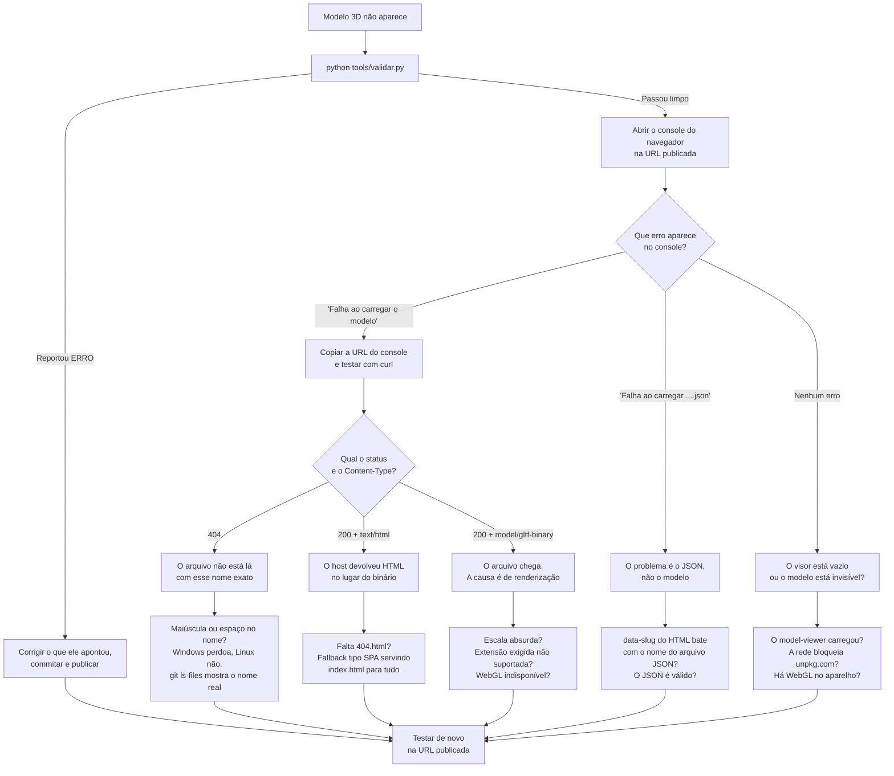

# Quando o modelo 3D não aparece

> Guia de diagnóstico. Escrito depois de um caso real em 2026-09-01: o
> ACRIMSAT não carregava, e a mensagem na tela sugeria falta de internet.
> A causa era uma letra maiúscula no nome do arquivo.

---

## Antes de tudo: o princípio

**A camada onde o sintoma aparece quase nunca é a camada onde está a causa.**

Um modelo 3D que não renderiza parece problema de modelo 3D. Nos dois casos
reais deste projeto até hoje, era problema de **HTTP** — o arquivo não estava
chegando ao navegador.

Por isso a ordem do diagnóstico é sempre a mesma, de baixo para cima:

```
1. O arquivo existe?          (sistema de arquivos / Git)
2. O arquivo é servido?       (HTTP: status e Content-Type)
3. O arquivo é decodificado?  (Draco, extensões exigidas)
4. O arquivo é renderizado?   (WebGL, escala, câmera)
```

Pular para o passo 4 é o erro clássico. Os passos 1 e 2 custam um comando
cada.

---

## Passo zero

```bash
python tools/validar.py
```

Ele existe justamente por causa do caso do ACRIMSAT, e pega a maioria dos
problemas antes de você publicar. Se ele reportar `ERRO`, pare aqui e
corrija — não adianta investigar mais nada.

---

## Fluxograma do caminho de correção



---

## O comando que responde três perguntas de uma vez

```bash
curl -s -o /dev/null -w "%{http_code}  %{content_type}  %{size_download}\n" <url>
```

| O que devolve | O que significa |
|---|---|
| `200  model/gltf-binary  2115124` | O arquivo chega inteiro. A causa está adiante. |
| `404  text/html  923` | O arquivo não existe naquele caminho. |
| `200  text/html  1789` | **O pior caso.** O host respondeu "deu certo" e mandou HTML. |

O terceiro caso é o mais perigoso: o `<model-viewer>` recebe status 200 e não
tem erro nenhum para reportar. O sintoma vira tela preta sem explicação.

Compare o tamanho com o do seu `index.html`. Se forem iguais, é fallback do
host, não o seu modelo.

**Sempre teste na URL publicada, não em `localhost`.** O servidor local não
reproduz o roteamento nem a sensibilidade a maiúsculas do host.

---

## Causas conhecidas, da mais comum para a mais rara

### 1. Maiúsculas no nome do arquivo

**Aconteceu em 2026-09-01.** JSON pedia `acrimsat.glb`, o arquivo era
`Acrimsat.glb`.

O Windows trata nomes ignorando maiúsculas; o Linux do Cloudflare Pages, não.
Resultado: funciona local, 404 em produção.

```bash
git ls-files assets/models/          # o nome que o Git realmente registrou
```

O `git ls-files` é a autoridade, não o Explorer do Windows nem o `ls`.

**Prevenção:** nomes de arquivo servidos pela web em minúsculas, sem espaço,
sem acento. A convenção do projeto é `assets/models/<slug>/modelo.glb`.

### 2. Espaços ou acentos no nome

**Aconteceu na Fase 0.** `CubeSat - 1 RU Generic.glb` virava
`CubeSat%20-%201%20RU%20Generic.glb` na URL. Funciona às vezes — e é o "às
vezes" que custa horas.

### 3. Host devolvendo HTML para tudo

**Aconteceu na Fase 0.** Todas as rotas retornavam o mesmo `index.html` com
status 200, inclusive o caminho do `.glb`.

É o *fallback de SPA*: útil em aplicações de página única, nocivo numa
arquitetura multi-página. A presença de um `404.html` na raiz é a hipótese de
correção que resolveu o caso.

### 4. Caminho errado no JSON

O código monta a URL assim:

```
/assets/models/<slug>/<modelo.arquivo>
```

O `<slug>` vem do `data-slug` do `<body>`, **não** da URL da página. Se o
`data-slug` estiver errado, tanto o JSON quanto o modelo vão para o lugar
errado.

### 5. Arquivo não publicado

O arquivo existe na sua máquina, mas:

- não foi commitado (`git status`);
- está sendo ignorado pelo `.gitignore`;
- foi commitado mas não foi feito push;
- o push foi feito mas o deploy ainda está rodando.

```bash
git status --short          # mudanças não commitadas
git ls-files <caminho>      # vazio = o Git não conhece o arquivo
```

### 6. Escala absurda

O modelo carrega, mas você não o vê — porque ele é grande demais (a câmera
está *dentro* dele) ou pequeno demais (um ponto invisível).

O glTF manda ler unidades como metros, mas nada garante que o autor do modelo
respeitou isso.

**Antes de calcular qualquer fator, descubra se o modelo já vem calibrado.**
Um GLB pode declarar `scale` nos próprios **nós** — e nesse caso o autor já
converteu o arquivo para metros, e aplicar outro fator por cima é engano.

| | Escala nos nós | O que o visor renderiza |
|---|---|---|
| CubeSat | `1` | 5,19 m → **precisa** de correção |
| ACRIMSAT | `0,01737` | 2,42 m → **já está certo** |

**Aconteceu em 2026-09-01.** O `0.048` do CubeSat foi copiado para o
ACRIMSAT, que já vinha calibrado. Resultado: 2,42 m × 0,048 = **11,6 cm**.
Em AR o satélite aparecia minúsculo e distante — e o sintoma sugeria erro da
câmera, não do dado.

Só quando os nós têm escala `1` é que o cálculo abaixo se aplica:

```
fator = tamanho_real_desejado ÷ maior_dimensão_renderizada
```

**A armadilha ao medir:** ler apenas o `min`/`max` dos vértices ignora a
escala dos nós e leva à conclusão oposta. Os vértices do ACRIMSAT vão a 138
unidades; ele renderiza com 2,42 m. O `tools/validar.py` calcula o tamanho
final corretamente e reporta erro quando um JSON aplica escala sobre um
arquivo que já vem calibrado.

### 7. Extensão exigida não suportada

Se o GLB declara algo em `extensionsRequired` — `KHR_draco_mesh_compression`,
por exemplo —, nenhum visualizador consegue renderizá-lo sem esse suporte.

O `<model-viewer>` busca o decodificador Draco de um CDN do Google, à parte
da própria biblioteca. **Numa rede escolar com firewall, esse download pode
ser bloqueado** — e aí um modelo que funciona na sua casa falha na escola.

O CubeSat exige Draco; o ACRIMSAT não.

### 8. A biblioteca não carregou

Se o `unpkg.com` estiver bloqueado ou fora do ar, o `<model-viewer>` nunca é
registrado como custom element. A tag fica no DOM, inerte, sem erro visível.

Sintoma: a área do visor fica vazia e o console não reclama do modelo — ele
reclama do script, se reclamar.

### 9. Sem WebGL

Aparelho antigo, GPU bloqueada, ou navegador com aceleração desligada. Nada
3D funciona. É um risco já registrado no `ARCHITECTURE.md` §9, e o tratamento
adequado é trabalho da Fase 4.

### 10. Aberto por `file://`

Duplo clique no `index.html` em vez de servir por HTTP. Módulos ES não
carregam, `fetch` é bloqueado, e caminhos absolutos apontam para a raiz do
disco.

---

## Checklist

Na ordem. Pare no primeiro item que falhar.

**Antes de publicar**

- [ ] `python tools/validar.py` passa sem `ERRO`
- [ ] o nome do arquivo é minúsculo, sem espaço e sem acento
- [ ] `git ls-files assets/models/` mostra o arquivo com o nome esperado
- [ ] `git status` está limpo e o push foi feito
- [ ] o deploy terminou

**Se ainda não aparece**

- [ ] abri a **URL publicada**, não `localhost`
- [ ] abri o **console do navegador** e li o erro
- [ ] copiei a URL do modelo do console e testei com `curl`
- [ ] o status é 200
- [ ] o `Content-Type` é `model/gltf-binary`, não `text/html`
- [ ] o tamanho bate com o do arquivo, e não com o do `index.html`

**Se o arquivo chega mas nada se vê**

- [ ] a escala foi calculada para **este** modelo, não copiada de outro
- [ ] o `extensionsRequired` do GLB é suportado
- [ ] a rede não bloqueia o CDN do decodificador
- [ ] o aparelho tem WebGL

**No celular**

- [ ] estou em HTTPS — AR e sensores não funcionam em `http://` de rede local
- [ ] no iOS, estou no **Safari**, não num navegador embutido de aplicativo

---

## Mensagens de erro: uma lição

A mensagem original desta página dizia:

> "Não foi possível carregar o modelo 3D. **Verifique a conexão** e recarregue
> a página."

O código não sabia que era problema de conexão. Sabia apenas que o
carregamento falhou. O palpite mandou procurar no lugar errado.

A mensagem atual relata só o que é sabido, e joga o diagnóstico no console:

```js
console.error("Falha ao carregar o modelo:", mv.src, evento.detail ?? evento);
mostrarErro("Não foi possível carregar o modelo 3D desta página.");
```

**Regra:** mensagem de erro relata o que aconteceu; nunca adivinha por quê.
Causa errada é pior que causa nenhuma — causa nenhuma faz investigar, causa
errada faz investigar o lugar errado.

---

## Ver também

- [ARCHITECTURE.md](../ARCHITECTURE.md) — estrutura de diretórios e orçamento
- [CUBESAT_PILOT.md](CUBESAT_PILOT.md) §6 — o raciocínio completo sobre escala
- [ROADMAP.md](../ROADMAP.md) — débitos técnicos conhecidos
- `tools/validar.py` — o script que automatiza boa parte deste checklist
